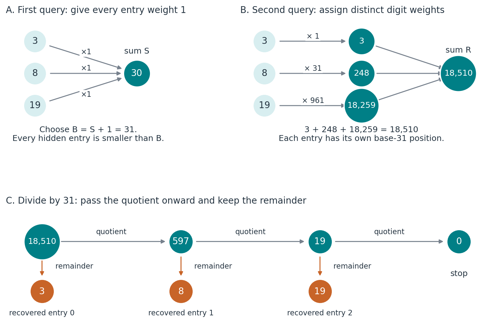
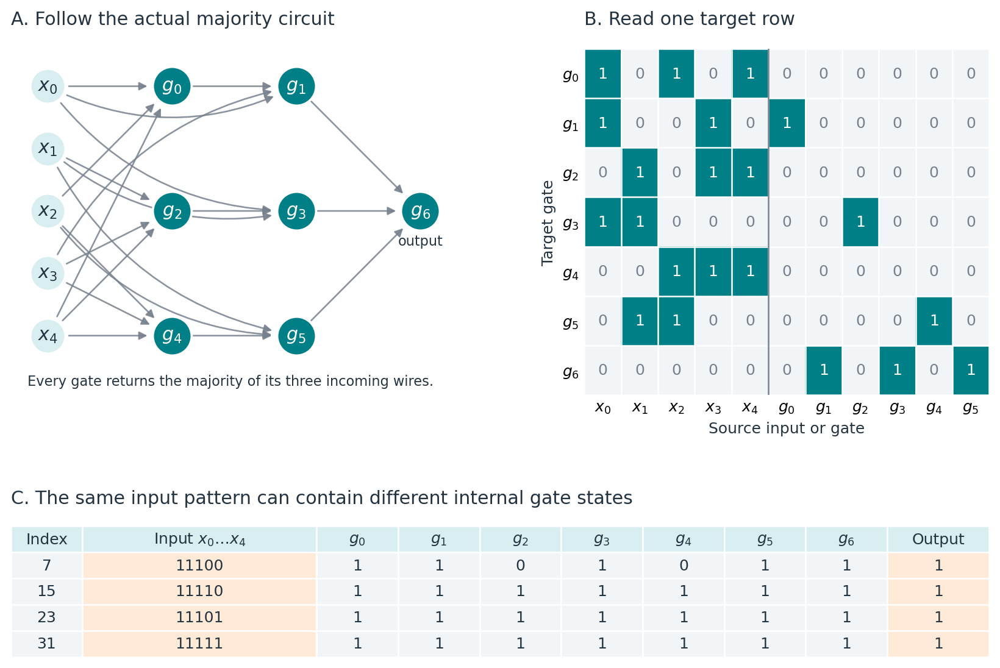
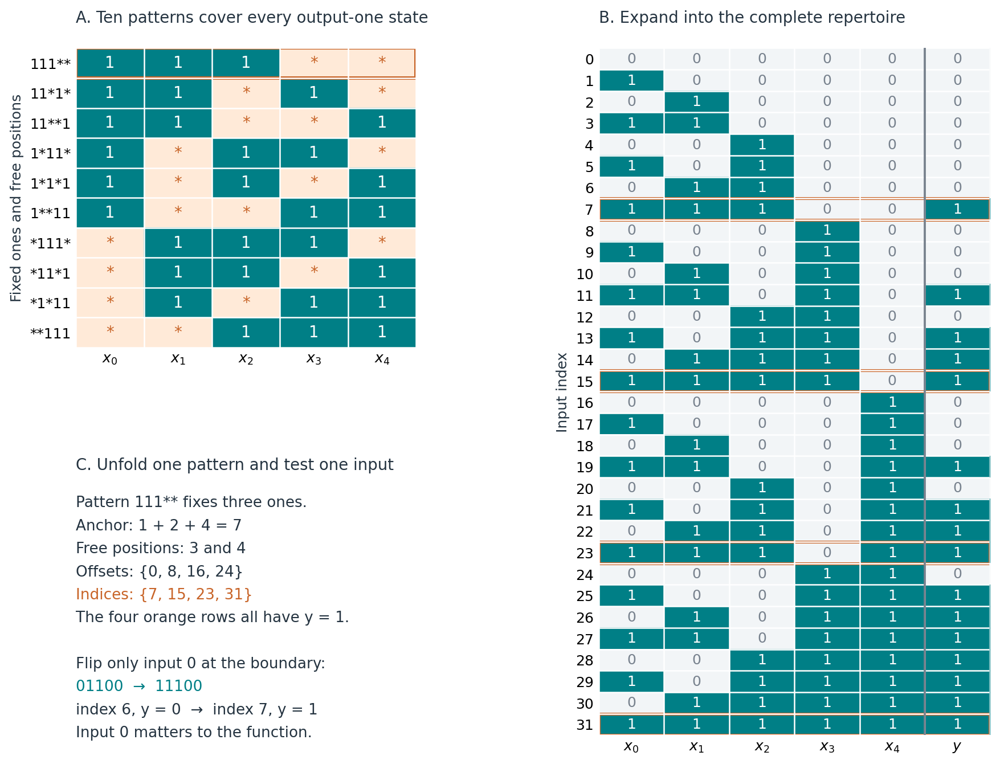
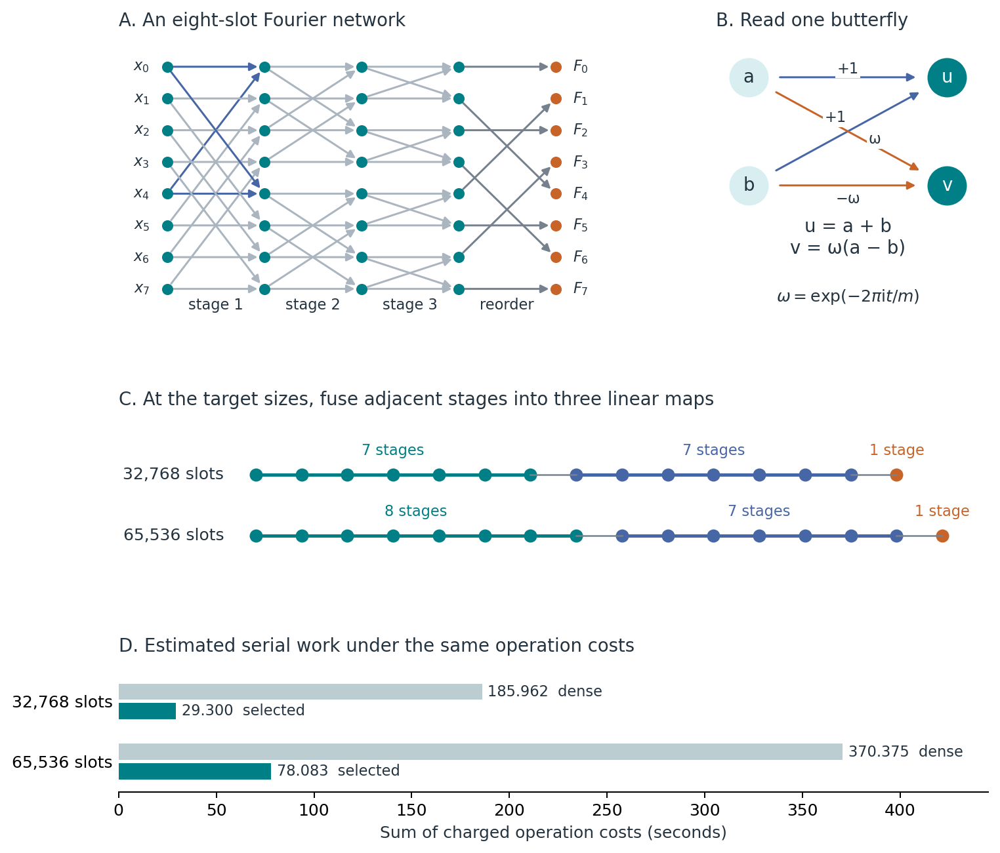
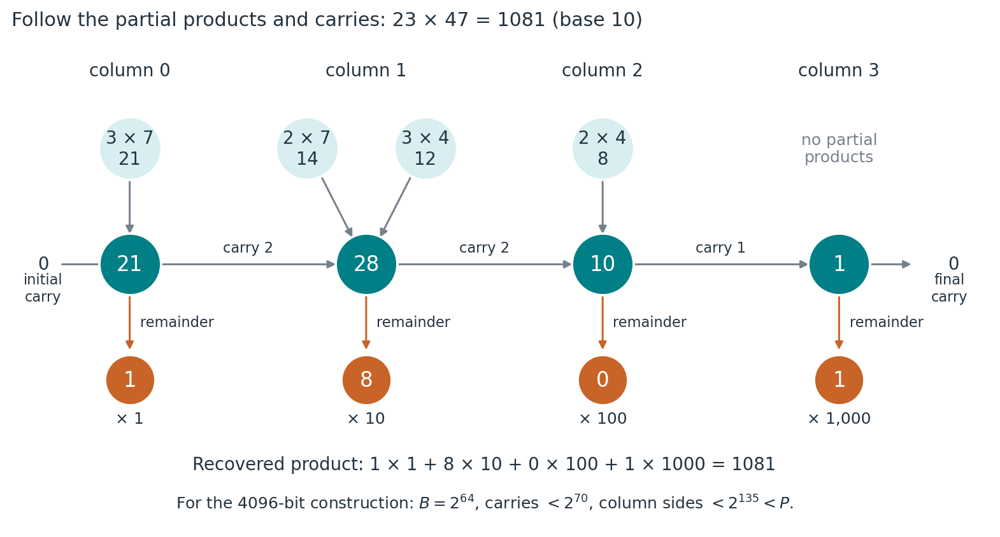

# Solutions to the challenges proposed by 0xPARC

**Alberto Hernandez-Espinosa — 15 September 2026**

Read the [main paper](response.pdf) and [Supplementary Information](supplementary.pdf). This is a short reading companion; the supplement contains the full proofs, conventions and verification details.

## The approach

The eight questions ask what can be computed using restricted operations. The answers use positional encoding, majority identities, Fourier factorisation and bounded integer arithmetic. The contribution of this response is to connect these constructions to exact representations and explicit checks of what they preserve.

Index deconvolution gives the Boolean part a second direction of explanation. Starting with a circuit, we calculate its complete repertoire. Starting with that repertoire, we recover the inputs that affect the output and describe the output-one states through patterns. Expanding those patterns must reproduce the same repertoire exactly. Run on a canonical decision diagram the same three steps need no repertoire written down, which carries the exact recovery of majority to 151 inputs. For the arithmetic questions the method supplies the gates themselves: each cell is stated as an integer relation and whatever comes back is compiled, so the full adder returns as XOR and MAJORITY without being named. Each answer declares whether the method derives it, certifies part of it, or only bounds it.

## Recovering a list (Q1)

Ask first for the sum S of the positive integer entries. Choose B = S + 1 and ask for the dot product with (1, B, B², …). The answer stores the entries as base-B digits. Repeated division by B recovers them as successive remainders.

For the list (3, 8, 19), S = 30, B = 31 and the packed answer is 18,510. Successive remainders recover 3, 8 and 19. If an upper bound is already known, one query suffices. For unbounded lists of length at least two, two adaptive rational queries are necessary and sufficient. Ideal exact real coefficients permit a one-query uniqueness argument, with a different precision assumption.

## A majority network and its patterns (Q2)

A cyclic variable-identification identity constructs odd majority using only three-input majority gates. Each step removes an active variable; recursion ends in input wires. This proves existence for every odd input count, including 2025.

The five-input example has seven gates. Arrows and matrix entries describe the same connections; the table follows actual inputs through every gate.

The inputs 11100, 11110, 11101 and 11111 all give output one. They share the pattern `111**`: the first three bits are fixed to one, while the last two may vary. Some internal gate outputs change even though the final answer is preserved.

Input positions have index weights 1, 2, 4, 8 and 16. The pattern `111**` therefore has decimal anchor 7. Its free-position fillings give offsets 0, 8, 16 and 24; adding these to the anchor gives indices 7, 15, 23 and 31. Expanding all ten patterns and taking their union recovers exactly the 16 output-one states.

An input can be free within a pattern and still affect the function elsewhere. Comparing 01100 with 11100 changes only input 0 and changes the output. Index deconvolution uses such paired states to recover functional dependence. It recovers the computed function, without determining a unique internal circuit.

The additional bounded check reconstructs all 2,730 states for odd input counts from 1 through 11, and the symbolic route recovers the circuit exactly at 151 inputs, covering 2^151 states without enumerating any. A majority of disjoint three-input majorities provides a useful incorrect-circuit control: it has the same functional inputs and the same output frequency as nine-input majority, but differs on 54 of 512 states. Equality requires comparing the actual output sets.

## A Fourier transform in three levels (Q3)

Group adjacent radix-two Fourier stages into three linear transforms. Each transform uses rotated copies of the packed input, multiplied by known coefficient vectors and added together. Sharing rotations reduces operation count. The final transform restores natural frequency order.

| Slots | Selected grouping | Estimated serial cost | Dense cost | Dense / selected |
|---:|:---:|---:|---:|---:|
| 32,768 | 7 + 7 + 1 | 29.299516 s | 185.962068 s | 6.347 |
| 65,536 | 8 + 7 + 1 | 78.083040 s | 370.374740 s | 4.743 |

The source uses both dimensions, so both are evaluated. These costs charge additions at 4 microseconds, known-vector multiplications at 5,600 and rotations at 6,100. They describe estimated serial work, not measured encrypted runtimes. The selected schedules minimise cost within the evaluated contiguous-stage family. Thirteen plaintext vectors per dimension agree with an independent transform to maximum normalised error below 2.2 × 10⁻¹⁵.

## Modular power sums (Q4)

For the prime q = 2¹²⁷ − 1, the only solution is zero. Eliminating d from the linear equation turns the cubic equation into −3(a + b)(a + c)(b + c) = 0. One pair sum must vanish. Relabelling gives b = −a and d = −c; the square equation then gives a² + c² = 0. Because q is 3 modulo 4, −1 is not a square in this field. All four entries must therefore be zero.

## Integer conditions through quadratic equations (Q5–Q8)

A bit satisfies b(b − 1) = 0. Sixty-four such bits and a weighted-sum equation restrict a field value to a 64-bit integer. The equation (r − 1)s = 1 has a witness exactly when r differs from one.

For a 64-bit factorisation, bound both factors and require uv = n with factors at least two. Their product is below the field modulus, so the field equality is an integer equality.

For a 4096-bit factorisation, represent each integer by 64 limbs in base 2⁶⁴. Form all partial products and connect multiplication columns by carries. Range-check the limbs and intermediate carries, fix endpoint carries to zero and require the upper output limbs to vanish. Every column side is then below the field modulus. Adding the weighted column equations cancels the carries and yields the intended integer product.

The direct systems contain 65, 1, 200 and 25,725 rows. The recovered-cell systems contain 335 rows for Q5, 2,193 for Q6 and 107,271 for Q7 at the full 64 bits. Exhaustive checking covers every triple at widths four, five and six, 299,008 in all, with no discrepancy; at 64 bits the system accepts genuine factorisations and rejects trivial factors, wrong products and a truncated overflow. The recovered route is larger everywhere and no efficiency claim is made for it. Q8 is answered by the direct limb construction and not by recovery: descriptions of integer multiplication grow by a factor of 2.977 per bit, measured across eleven widths, so a 4096-bit one would need about 10^1942 nodes against roughly 10^80 atoms in the observable universe. The supplement explains the proofs, implementation boundary and controls in detail.

## Scope

The finite evidence covers small majority circuits, full target-size plaintext Fourier evaluations and compiled arithmetic constraints. It does not include a materialised 2025-input majority circuit, ciphertext timings or generated zero-knowledge proofs. The network and pattern figures are generated from evaluated states, with exact reconstruction checks.
